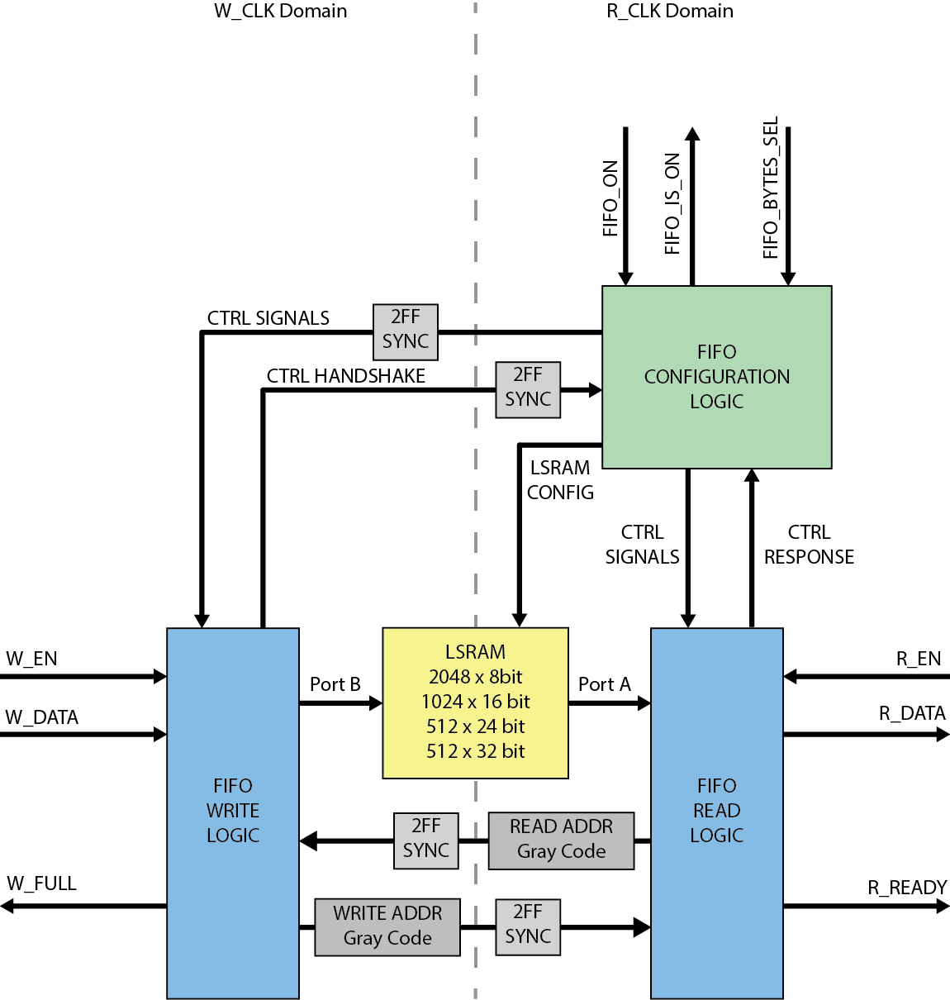
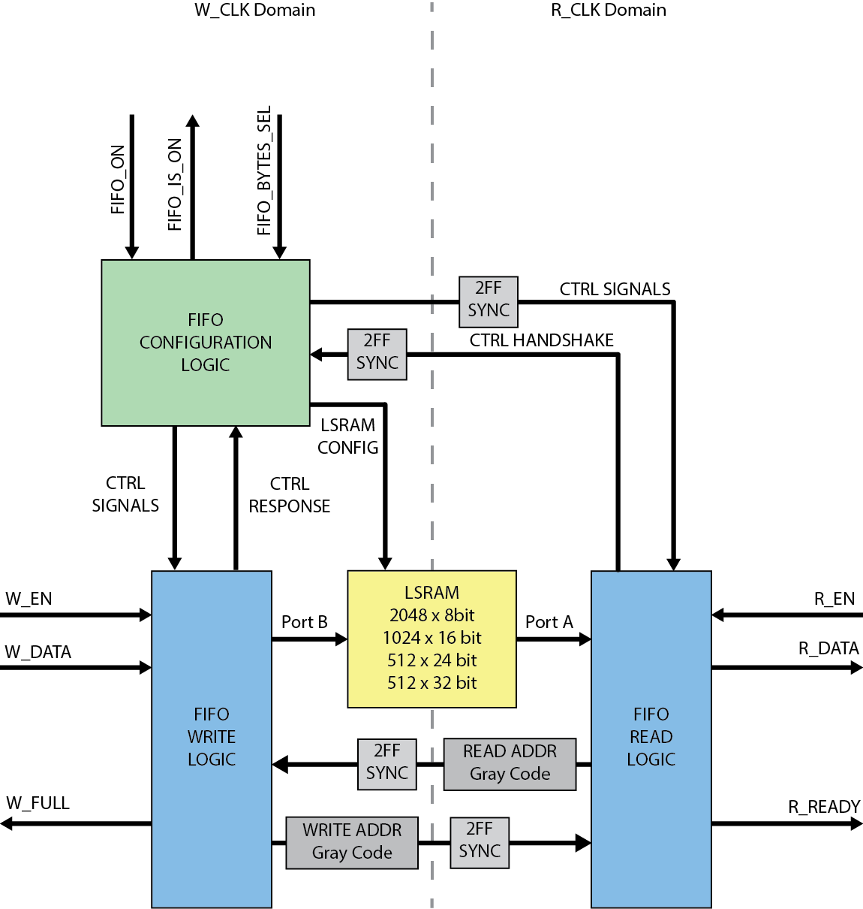

# FIFO_CDC

This Asynchronous FIFO was intended to have a configurable BRAM.

The usecase this spawned from was that I was going to ingest data from an ethernet PHY and move it into FPGA logic for processing. the GMII interface from the PHY operates at 125MHz and my FPGA logic operats at 100Mhz. In order to maintain throughput I wanted to be able to concatenate adjacent bytes together in the faster clock domain and then write them into the FIFO. e.g. a 32 bit word would be sent over ethernet 8 bits at a time over 4 clock cycles at 125Mhz and read out of the FIFO as a single 32 bit word at 100Mhz. The Core could then be paused and reconfigured for 8 bit data to feed a different peripheral.

This all fell apart when I tried to synthesize and received an error related to the dynamic data width on the LSRAM. This was something I wasn't sure about to begin with but at least I got to work through different CDC crossing techniques and have a first look at using OSVVM in my testbench.
 
R_CLK domain control

W_CLK domain control

The core works with very minor changes and I've done a simple test on hardware. I have no intention of updating or removing the now useless features and will just use IP cores for projects going forward.